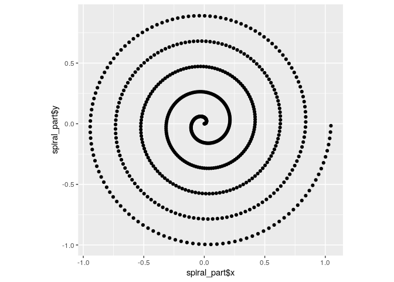

dddr: Three-Dimensional Vector Operations in R
================

# About

The R package `dddr` is a
[`vctrs`](https://github.com/r-lib/vctrs/)-based package for working
with three-diensional spatial data. It gives three-dimensional objects
like points, velocities, and rotations first-class vector status in R,
enabling usage as column types within `data.frame` and `tibble`.

In contrast to most spatial R packages like `sf` or `rspatial` that work
with geographic, 2-dimensional data, `dddr` works best with
3-dimensional data. The origin of this package was to analyze behavioral
data (e.g, hand motion, head direction) in studies of virtual and
augmented reality.

<!-- badges: start -->

[](https://travis-ci.com/MrMallIronmaker/dddr)
[](https://codecov.io/gh/MrMallIronmaker/dddr?branch=master)
<!-- badges: end -->

# Quick View

``` r
library(tidyverse)
library(dddr)
```

``` r
spiral <- tibble(i = seq(0, 10*pi, 0.05)) %>%
  mutate(
    # vector3s are created using three numeric vector arguments,
    # and thanks to dplyr, can refer to other columns in the dataframe
    circular_part = vector3(x=cos(i), y=sin(i), z=0),
    forward_part = vector3(x=0, y=0, z=i/15),
    # vector3s can be added together and multiplied by numerics 
    spiral_part = circular_part * i / 30 + forward_part
  )

spiral %>% head(10)
```

    ## # A tibble: 10 x 4
    ##        i      circular_part    forward_part                   spiral_part
    ##    <dbl>             <vct3>          <vct3>                        <vct3>
    ##  1  0    (1    , 0     , 0) (0, 0, 0      ) (0      , 0        , 0      )
    ##  2  0.05 (0.999, 0.0500, 0) (0, 0, 0.00333) (0.00166, 0.0000833, 0.00333)
    ##  3  0.1  (0.995, 0.0998, 0) (0, 0, 0.00667) (0.00332, 0.000333 , 0.00667)
    ##  4  0.15 (0.989, 0.149 , 0) (0, 0, 0.01   ) (0.00494, 0.000747 , 0.01   )
    ##  5  0.2  (0.980, 0.199 , 0) (0, 0, 0.0133 ) (0.00653, 0.00132  , 0.0133 )
    ##  6  0.25 (0.969, 0.247 , 0) (0, 0, 0.0167 ) (0.00807, 0.00206  , 0.0167 )
    ##  7  0.3  (0.955, 0.296 , 0) (0, 0, 0.02   ) (0.00955, 0.00296  , 0.02   )
    ##  8  0.35 (0.939, 0.343 , 0) (0, 0, 0.0233 ) (0.0110 , 0.00400  , 0.0233 )
    ##  9  0.4  (0.921, 0.389 , 0) (0, 0, 0.0267 ) (0.0123 , 0.00519  , 0.0267 )
    ## 10  0.45 (0.900, 0.435 , 0) (0, 0, 0.03   ) (0.0135 , 0.00652  , 0.03   )

``` r
spiral %>%
  # field access uses the $ operator
  ggplot(aes(x=spiral_part$x, y=spiral_part$y)) +
  geom_point() +
  geom_path() +
  coord_equal()
```

<!-- -->

``` r
spiral %>%
  mutate(
    # rotations can be specified using quaternions, axis / angle, or even from / to vectors
    spiral_rotated = rotate(spiral_part, axis=c(0, 1, 0), angle=pi/4)
  ) %>% 
  ggplot(aes(x=spiral_rotated$x, y=spiral_rotated$y)) +
  geom_point() +
  geom_path() +
  coord_equal()
```

<!-- -->

# Contributions

Contributions are welcome\! The issue tracker in this repo can be used
for bug reports, feature requests, and questions - whatever you might
need.
